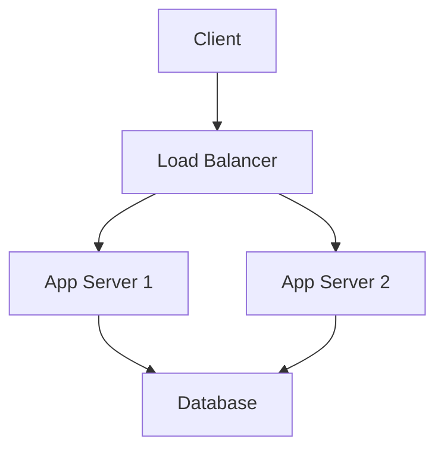

# Architecture Documentation Guide

Clear architecture documentation helps teams understand system design, make informed decisions, and maintain consistency. This guide helps you create effective architecture documentation.

## Why Document Architecture?

- **Shared Understanding**: Everyone understands the system design
- **Decision Making**: Provides context for technical decisions
- **Onboarding**: New team members learn the system faster
- **Evolution**: Tracks how architecture changes over time
- **Communication**: Bridges technical and non-technical stakeholders

## Documentation Structure

Your `docs/architecture.md` should include:

1. System Overview
2. Architecture Diagram
3. Component Breakdown
4. Data Flow
5. Technology Stack
6. Design Decisions
7. Future Considerations

## Template

```markdown
# Architecture Documentation

## System Overview

[Project Name] is a [brief description] that enables users to [primary functionality].

**Key Goals:**
- Goal 1 (e.g., Real-time data processing)
- Goal 2 (e.g., Scalability to 100k+ users)
- Goal 3 (e.g., 99.9% uptime)

**Non-Goals:**
- What this system explicitly does NOT do
- Helps set boundaries and expectations

## Architecture Diagram

[Include high-level architecture diagram here]

\`\`\`
┌──────────────┐
│   Clients    │
│ (Web/Mobile) │
└──────┬───────┘
       │
       ↓
┌──────────────┐
│     CDN      │
│  CloudFront  │
└──────┬───────┘
       │
       ↓
┌──────────────────────────────────┐
│        Load Balancer             │
└──────┬───────────────────────────┘
       │
       ↓
┌──────────────────────────────────┐
│      Application Servers         │
│    (ECS/Kubernetes Cluster)      │
└──────┬───────────┬────────────────┘
       │           │
       ↓           ↓
┌──────────┐  ┌──────────┐
│   Cache  │  │ Database │
│  Redis   │  │PostgreSQL│
└──────────┘  └──────────┘
\`\`\`

## Components

### Frontend Application

**Purpose**: User interface and client-side logic

**Technology**: React 18 + Vite + TypeScript

**Key Features:**
- Single-page application with React Router
- State management with Zustand
- API communication via React Query
- Responsive design with Tailwind CSS

**Location**: `/frontend/src`

**Dependencies:**
- React Router for navigation
- React Query for data fetching
- Zod for validation

### Backend API

**Purpose**: Business logic and data access layer

**Technology**: Node.js + Express + TypeScript

**Key Features:**
- RESTful API design
- JWT authentication
- Input validation with Zod
- Rate limiting and security middleware

**Location**: `/backend/src`

**Endpoints:**
- `GET /api/health` - Health check
- `POST /api/auth/login` - User authentication
- `GET /api/users` - List users
- `POST /api/users` - Create user
- ... (list all major endpoints)

### Database

**Purpose**: Persistent data storage

**Technology**: PostgreSQL 15

**Schema Overview:**
- `users` - User accounts and profiles
- `sessions` - Active user sessions
- `audit_log` - System audit trail

**Location**: `/backend/migrations`

### Cache Layer

**Purpose**: Performance optimization and session storage

**Technology**: Redis 7

**Usage:**
- Session storage (TTL: 24 hours)
- API response caching (TTL: 5 minutes)
- Rate limiting counters

### Message Queue (if applicable)

**Purpose**: Asynchronous task processing

**Technology**: Redis/RabbitMQ/SQS

**Queues:**
- `email` - Email sending tasks
- `export` - Data export jobs
- `webhook` - Webhook deliveries

## Data Flow

### User Authentication Flow

\`\`\`
User → Frontend → POST /api/auth/login → Backend
                                            ↓
                                     Verify credentials
                                            ↓
                                      Generate JWT
                                            ↓
Frontend ← Token ← Backend
   ↓
Store token in localStorage
   ↓
Include in subsequent requests
\`\`\`

### Data Retrieval Flow

\`\`\`
User → Frontend → GET /api/data → Backend
                                     ↓
                               Check cache (Redis)
                                     ↓
                           Cache hit? Return cached
                                     ↓ No
                            Query database (PostgreSQL)
                                     ↓
                               Transform data
                                     ↓
                              Update cache
                                     ↓
Frontend ← JSON Response ← Backend
   ↓
Update UI
\`\`\`

## Technology Stack

### Frontend
- **Framework**: React 18.2
- **Build Tool**: Vite 4.x
- **Language**: TypeScript 5.x
- **Styling**: Tailwind CSS 3.x
- **State Management**: Zustand
- **Data Fetching**: TanStack Query (React Query)
- **Routing**: React Router 6.x
- **Testing**: Vitest, React Testing Library

### Backend
- **Runtime**: Node.js 18 LTS
- **Framework**: Express 4.x
- **Language**: TypeScript 5.x
- **ORM**: Prisma / TypeORM
- **Validation**: Zod
- **Authentication**: JWT (jsonwebtoken)
- **Testing**: Jest, Supertest

### Infrastructure
- **Hosting**: AWS / Azure / Vercel
- **Database**: PostgreSQL 15 (AWS RDS)
- **Cache**: Redis 7 (ElastiCache)
- **CDN**: CloudFront / Cloudflare
- **CI/CD**: GitHub Actions
- **Monitoring**: DataDog / CloudWatch
- **Logging**: Winston / Pino

## Design Decisions

### Decision: REST API vs GraphQL

**Chosen**: REST API

**Rationale:**
- Simpler to implement and maintain
- Well-understood by team
- Sufficient for our use cases
- Easy to cache with standard HTTP

**Trade-offs:**
- Potential over-fetching of data
- Multiple requests for related data
- Less flexible for clients

**Date**: 2024-01-15

### Decision: Monorepo vs Polyrepo

**Chosen**: Monorepo

**Rationale:**
- Frontend and backend share TypeScript types
- Easier to coordinate changes across layers
- Simpler dependency management
- Single CI/CD pipeline

**Trade-offs:**
- Larger repository size
- All code visible to all developers
- More complex build tooling

**Date**: 2024-01-10

### Decision: SQL vs NoSQL Database

**Chosen**: PostgreSQL (SQL)

**Rationale:**
- Strong consistency guarantees
- Complex relational queries needed
- ACID transactions required
- Mature tooling and ecosystem

**Trade-offs:**
- Less flexible schema
- Vertical scaling limits
- More complex sharding if needed

**Date**: 2024-01-08

## Architectural Patterns

### API Design Pattern

Following RESTful principles:
- Resources identified by URLs
- HTTP methods for operations (GET, POST, PUT, DELETE)
- Stateless communication
- JSON for data exchange

### Error Handling Pattern

Consistent error responses:
\`\`\`json
{
  "error": {
    "code": "VALIDATION_ERROR",
    "message": "Invalid email format",
    "details": [
      {
        "field": "email",
        "message": "Must be a valid email address"
      }
    ]
  }
}
\`\`\`

### Authentication Pattern

JWT-based authentication:
1. User submits credentials
2. Server validates and issues JWT
3. Client includes JWT in Authorization header
4. Server validates JWT on each request
5. JWT expires after 24 hours

### Caching Strategy

Multi-level caching:
1. Browser cache (static assets)
2. CDN cache (public content)
3. Redis cache (API responses)
4. Database query cache

## Security Considerations

### Authentication & Authorization
- JWT tokens with expiration
- Password hashing with bcrypt
- Role-based access control (RBAC)
- API rate limiting per user

### Data Protection
- Encryption in transit (TLS/HTTPS)
- Encryption at rest (RDS encryption)
- Sensitive data masking in logs
- PII handling compliance

### API Security
- Input validation on all endpoints
- SQL injection prevention via ORM
- XSS protection with sanitization
- CORS configuration for allowed origins

## Scalability

### Current Capacity
- 10,000 concurrent users
- 100 requests/second
- 100 GB database size
- 99.9% uptime

### Horizontal Scaling
- API servers: Scale to 10+ instances
- Database: Read replicas for queries
- Redis: Cluster mode for high availability

### Vertical Scaling
- Database: Upgrade to larger instance
- Redis: Increase memory allocation

## Performance

### Response Time Targets
- API endpoints: < 200ms (p95)
- Database queries: < 50ms (p95)
- Page load: < 2s (p95)

### Optimization Strategies
- Database indexing on frequently queried fields
- N+1 query prevention via eager loading
- API response caching in Redis
- CDN for static asset delivery
- Code splitting for frontend bundles

## Data Management

### Data Retention
- User data: Retained until account deletion
- Audit logs: 1 year retention
- Analytics data: 3 months retention

### Backup Strategy
- Database: Daily automated backups
- Retention: 30 days
- Point-in-time recovery: Enabled

### Data Privacy
- GDPR compliance for EU users
- User data export capability
- Right to deletion support

## Integration Points

### Third-Party Services
- **Authentication**: Auth0 / Firebase Auth (optional)
- **Email**: SendGrid / AWS SES
- **Payments**: Stripe (if applicable)
- **Analytics**: Google Analytics / Mixpanel
- **Error Tracking**: Sentry

### Webhooks
- Outgoing webhooks for events
- Retry logic with exponential backoff
- Signature verification for security

## Development Workflow

### Local Development
1. Clone repository
2. Start devcontainer
3. Run `npm install`
4. Run `npm run dev`
5. Access at http://localhost:3000

### Code Organization
\`\`\`
src/
├── components/      # React components
├── services/        # API clients
├── hooks/           # Custom React hooks
├── utils/           # Utility functions
├── types/           # TypeScript types
└── App.tsx          # Main application
\`\`\`

## Monitoring & Observability

### Metrics
- Response times
- Error rates
- Request volume
- Database connection pool

### Logging
- Structured JSON logs
- Log levels: ERROR, WARN, INFO, DEBUG
- Request/response logging
- Correlation IDs for tracing

### Alerting
- High error rate (> 1%)
- Slow response time (> 1s)
- Database connection issues
- High memory usage (> 85%)

## Future Considerations

### Planned Enhancements
- [ ] Add WebSocket support for real-time features
- [ ] Implement full-text search with Elasticsearch
- [ ] Add GraphQL API alongside REST
- [ ] Microservices for specific domains

### Technical Debt
- Refactor auth module for better testability
- Migrate to newer database schema version
- Improve error handling consistency

### Scalability Roadmap
- Phase 1: Vertical scaling (current)
- Phase 2: Read replicas for database
- Phase 3: Microservices architecture
- Phase 4: Multi-region deployment

## Glossary

- **CDN**: Content Delivery Network
- **JWT**: JSON Web Token
- **ORM**: Object-Relational Mapping
- **RBAC**: Role-Based Access Control
- **RTO**: Recovery Time Objective
- **RPO**: Recovery Point Objective

## References

- [API Documentation](./api.md)
- [Deployment Guide](./deployment.md)
- [Development Guide](./development.md)
- [ADR Repository](../adr/) - Architecture Decision Records
```

## Best Practices

### 1. Use Diagrams

Visual representations help understanding:
- System architecture diagrams
- Data flow diagrams
- Sequence diagrams
- Entity-relationship diagrams

### 2. Explain "Why"

Don't just document "what" - explain "why":
- Why this technology was chosen
- Why this pattern was adopted
- Why alternatives were rejected

### 3. Keep It Current

Update architecture docs when:
- Adding new components
- Changing technology stack
- Making architectural decisions
- After major refactors

### 4. Document Decisions

Use Architecture Decision Records (ADRs):
```markdown
# ADR 001: Use PostgreSQL for Database

## Status
Accepted

## Context
We need a database for storing user and application data.

## Decision
We will use PostgreSQL as our primary database.

## Consequences
- Strong consistency and ACID guarantees
- Well-known query language (SQL)
- Excellent tooling and ecosystem
- Requires more planning for schema changes
```

### 5. Include Examples

Show concrete examples:
- Example API requests/responses
- Example database queries
- Example configuration files

### 6. Link to Code

Reference actual code when helpful:
```markdown
See implementation in `src/services/api.ts`
```

### 7. Document Trade-offs

Every decision has trade-offs - document them:
- What you gained
- What you gave up
- When to reconsider

## Tools for Diagrams

### Mermaid (Markdown)


### Draw.io
- Free, web-based
- Integrates with GitHub
- Export as PNG/SVG

### Lucidchart
- Professional diagramming
- Collaboration features
- Templates available

### PlantUML
- Text-based diagrams
- Version control friendly
- Good for sequence diagrams

## Review Checklist

Ensure your architecture documentation includes:

- [ ] System overview and goals
- [ ] High-level architecture diagram
- [ ] Component descriptions
- [ ] Data flow explanations
- [ ] Technology stack details
- [ ] Design decisions with rationale
- [ ] Security considerations
- [ ] Scalability plan
- [ ] Performance targets
- [ ] Integration points
- [ ] Future considerations
- [ ] Links to related documentation
